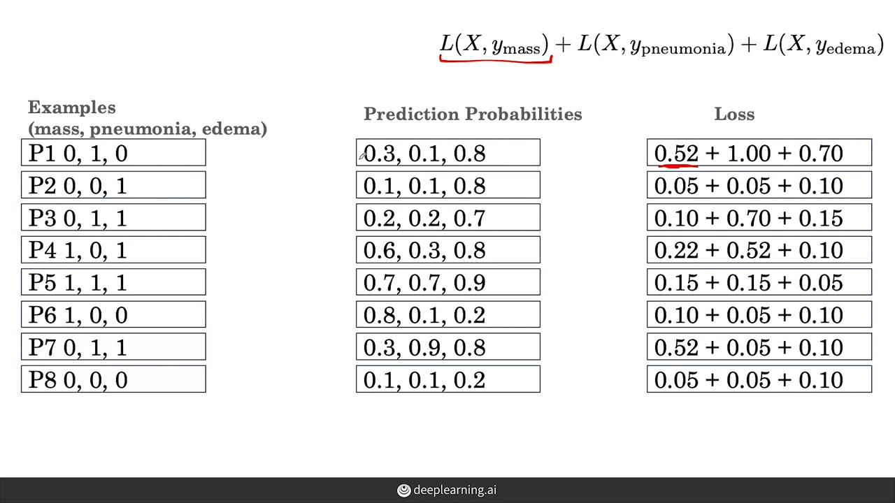

+++
title = 'Notes on AI for Medical Diagnosis'
date = 2024-06-05T16:37:31-07:00
draft = false
+++
>This note is generated for my learning of Course AI for Medical Diagnosis by deeplearning.ai. Any errors or misrepresentations are almost my own.

## Medical Imaging Application Examples
### Dermatology
- cancerous or not
    - use CNN training classification
    
### Ophthalmology (eye)
- Retinal Fundus Photos
    - check if Diabetic Retinopathy (DR)
    
### Histopathology
- examination of tissues under the microscope
    - tissue images called: Whole-slide image
    - cancer spread or not?
    - use patches of a large image to fed into the DL algorithm
    - can be used in **brain tumor segmentation**
    
## Chest X-Ray Project 
- critical detection of pneumonia, lung cancer etc.
- look at lungs, heart, etc.
- project target: abnormality called **Mass**
    - classification problem: whether the image contains **Mass**
    
- algorithm training process:
    
- Key algorithm Computer Vision: Image Classification
### 3 key challenges

#### I.Class Imbalance Problem
- i.e. data set will likely have more healthy normal images, and less abnormal images, making the data skewed
- problem: for not prevalent/rare disease, it is better off just predict all as normal, still getting great accuracies
- use binary cross-entropy loss (classification binary loss function, logistic regression)
    - **Single output**: probability value between $[0, 1]$ 
        - formula: $L(X,y) = -y*log(1-\hat{y}) - (1-y)*log(\hat{y})$, where $\hat{y}= P(Y=0|X)$ 
        - for $\hat{y} < 0.5$ => not abnormal, 
        - for $\hat{y} \geq 0.5$ => abnormal
        - coefficient $y$ is the value of ground truth, therefore only $0$ or $1$
            - when $y=1$, only term is -log(\hat{y})
    - **Vector Output**: (1) vector of prediction probabilities & (2) vector of Loss
        
        - we can add up total loss from both mass and normal examples:
        
        - i.e. the most lost are contributed by Normal examples (i.e. due to we have more data examples of normal cases)   
##### Solution to Class Imbalance
**1. Weight the normal and mass class differently**

- i.e. now we weight the mass class more, so that the total loss contribute from mass and normal classes are the same
    
    - weight formula: 
        - $w_{positive} = \frac{negative}{total} $
        - $w_{negative} = \frac{positive}{total} $
**2. Resampling:**
- resample the data so that the normal and mass classes have the same amount of numbers:
    - you can pull **part of the examples** from the normal (bigger data set)
    - you can **repeat** examples from the mass (smaller data set)

- even if we don't weight the classes, by using resampling technique we can still have balanced contribution of loss from all classes.

#### II. Multi-Task Problem
- Multi-task learning: we can use the same data (features) for different target outcome
    - instead of one set of feature for one task, now we have same set of features (e.g.common symptoms) for multi-tasks using the same algorithm

##### Solution to Multi-Task Problem    
- **input label**: instead of 1 label, for each image now we have **3 labels (mass, pneumonia, edema), a vector with 3 binaries**
    - e.g. $[0,1,0]$ means pneumonia but without mass or edema
- **output**: now we have 3 probabilities in a vector for 3 disease
- now our algorithm have prediction and loss function:

- multi-task loss: $L(X, y_{mass}) + L(X, y_{pneumonia}) + L(X, y_{edema}) $
- for each disease, we can overcome sub-example class imbalances by weights:

#### III. Dataset Size Problem
- Usually CNN can be easily assigned to unstructured medical data for learning, such as 2D image data, as well as medical signal processing, 3D medical images (e.g. CT scan)
- CNN current frameworks:

    - Google Inception-v3, ResNet, DenseNet, EfficientNet
- Problem is that CNN craves for large dataset, but in reality we don't have enough dataset for training
    - medical image datasets typically have **10K to 100K** examples (images with labels)
    - compare: other natural data imageNet can have **millions of images** with labels
##### Solution for Datset Size
1. Pretraining and Fine-tuning, transfer learning

    - pretraining: early layers can be trained from million natural images for general features, 
    - fine-tuning: where higher-level features for later layers can be fine-tuned using medical data
2. Data Augmentation
- we can: rotate, zoom-in/out, change contrast, flip
- do augmentations reflect variations in real world?
    - e.g. **change contrast** -- yes for many image tasks
    - e.g. **flip**: heart can be in different part of the body -- not good for chest X-ray
    - e.g. **rotation + flip** = good for skin cancer disease
    - e.g. **rotate + crop + color noise** = good for histopathology images
### Model Evaluation

- (1) Training Set "development set": development of models, use for training
- (2) Validation Set "tuning set" "dev set": hyper parameter training and estimate for performance in test
    - (1) & (2) can be combined multiple times to use in Cross-Validation to reduce variability in our estimates of the model performance
- (3) Test set "Holdout Set"
#### 3 Challenges in building the 3 Data sets
##### 1. Patient Overlap
- e.g. patient wearing the same necklace for two X-rays
    - leading to **over-optimistic test-set performance**
    - similar to information leak
    
- **Solution**: same patient can be only designated to one set
    - X-rays belongs to the same patient must be in the same set
    - to avoid patient over-lap
##### 2. Set Sampling

When do set sampling, we first sample the *Test Set*, then *Validation* **because we want our validation set to have the same distribution of classes as our test set**, and finally *Training set* with the remaining patients.
- Problem: Due to small datasets in the first place, when we try to pulling the test set (10\% from the dataset), we maynot get any disease samples, some times, the disease samples may not even make the 10\% of the whole dataset. 
- **Common Solution**
    - Test set with at least $X\%$ minority class (disease), sometimes $X$ is set to 50\%
    - use before-mentioned class-imbalance techniques to combat the problem.
##### 3. Ground Truth/Reference Standard
- the **right label**, or $y$: "Ground Truth" in Machine Learning, "Reference Standard" in Medicine context
- But in medical settings, **inter-observer disagreement** is very common
    - then How do we get the ground truth?
    - use **Consensus Voting mechanism**
        - majority votes
        - or like a jury and reach a final verdict
    - Use **a more Definitive test**:
        - e.g. for chest X-ray, we can add a CT-scan 3D image for further diagnosis accuracy
        - e.g. Skin lesion biopsy for cancerous probability in skin image
    

## Evaluating Models
Due to the fact that outcome of model in medicine is high impact, we will need explanation for the outcome and what does the model do. 
Some key terms:
- Sensitivity: True Positives, patient having disease and predict positive for the disease, or $P(+|disease)$
- Specificity: True Negatives, patient healthy and predict negative for the disease, or $P(-|normal)$
- Predictive values
- ROC curve
### Key Evaluation Metrics
How good is a Model?? We will need some evaluation metrics to evaluate the model.
#### 1.Accuracy metric
$$ Accuracy = \frac{\text{Examples correctly classified}}{\text{Total number of examples}}$$

Problem: when accuracy failed for true disease (False Negative) it is more of a problem than failed for False Positive. examples as follows:

Both model has the same 8/10 accuracy but obviously, Model 1 is more disastrous to real patients and Model 2 is actually "better" in a sense.
**Define accuracy metric:**

- **Sensitivity = $P$(+|disease)**
    - "if a patient has the disease, what is the probability that the model predicts positive?"
    - = $\frac{\text{number of true positives}}{\text{number of disease examples}} $
- **Specificity = $P$(-|normal)**
    - "If a patient is normal, what is the probability that the model predicts negative?"
    - = $\frac{\text{number of true negatives}}{\text{number of normal examples}} $
- **Prevalence = $P$(disease)**
    - the prevalence of the disease occurrence
    - = $\frac{\text{number of disease examples}}{\text{number of total examples}} $
    - $P$(normal) = 1 - $P$(disease) 
- Accuracy = Sensitivity * prevalence + Speicificity * (1 - prevalence)
    - see prevalence and  1-prevalence as weights
    
    
#### 2. PPV model
- In clinic, doctors are interested in **$P$(disease|+)**
    - if a model prediction is positive, what is the probability that a patient has the disease?
    - **Positive Predictive Value, PPV**
    
    - $P$(disease|+) = $\frac{\text{number of true positive}}{\text{number of positive predictions}}$
- Similarly, doctors are also interested in **$P$(normal|-)**   
    - If a model prediction is negative, what is the probability that a patient is normal?
    - **Negative Predictive Value**, **NPV**
    
    - $P$(normal|-) = $\frac{\text{number of true negative}}{\text{number of negative predictions}}$

#### 3. Confusion Matrix

### Threshold and Evaluation Metrics
- The most useful tools to evaluate medical models, **the ROC curve**. 
    - How the ROC curve allows us to visually plot the **sensitivity** of a model against the **specificity** of the model at **different decision thresholds**. 
- **ROC: "Receiver Operating Characteristic Curve"**
    - Graph showing performance of a classification model at all classification thresholds.
    - plot 2 parameters: TP Rate (TPR) and FP rate (FPR)
    - https://en.wikipedia.org/wiki/Receiver_operating_characteristic
- **Threshold and operating point**
    - e.g. A **chest x-ray classification** model outputs a probability of disease. This output can be transformed into a diagnosis using a **threshold** or **operating point**.  
    
- Choice of threshold affects the metrics:
    - e.g. if threshold $t = 0$ then we would **classify everything as positive**, then $sensitivity = 1$,  $specificity = 0$. 
    - e.g. if threshold $t = 1$ then we would **classify everything as negative**, then $sensitivity = 0$,  $specificity = 1$. 
#### Example: Change of threshold will change sensitivity and specificity
threshold initial setup t = 0.5: 
change to a larger threshold: 
change to threshold = 1: 

### Confidence Intervals
COnfidence Interval: to report the variability in the estimate

this way to conceptualize confidence interval: thinking about repeated sampling and how many of the samples will contain the mean

For larger sampling size, we will have tighter confidence intervals (better representing the whole population), whereas smaller sampling size will have a wider confidence intervals.

Why it is useful? Even when we cannot run the model on a whole population, we can at least use a **test result on a sample** to express the **range (the confidence interval)** in which we are **certain our population accuracy lies**.

## Medical Image Segmentation
- Image classification to classify whether the image contains the disease. What is image segmentation? It outlines which part of the image contains the disease. Very useful in medical image applications:
    - Quantification of the size of tissue
    - Localization of diseases
    - Treatment planning

### Exploring MRI Data and Tumor Segmentation
- Lab
#### MRI Data Overview
- 3D data
- a form that we can input into the segmentation model
- MRI sequence: 3D volume
    - can be in axial or coronal view
    - MRI examples consists of multiple imaging sequences
##### How can be combine these multiple 3D volumns into 1 3D volume?
- pick a slice through the brain viewed on 3 different MRI sequences:

- **key idea**: combine the information from different sequences and treat them as **different channels**
- similar to have RGB channel:

- Then we combine all the channels to become 1 single image:

    - to machine, this is an image with depth
##### Problem: may have some misaligned (tilted) images/channels
- i.e. the brain location in one channel may not corresponding to the brain location in others

##### How to solve the misaligned problem?
- Preprocessing approach: **Image registration**
    - to register/pre-process the image to make it align
    

### Image Segmentation
- After the images are registered, we now can combine the images for single slice
    
- **Segmentation is the process of defining the boundaries of various tissues**    
    - e.g. to define the boundaries of tumors
    - or to think of as classifying each point (pixels or voxels) in images (whether it is part of tumor or something else)
        - 2D image space: pixels
        - 3D image space: voxels
- 2 Approaches:
    - 2D approach: make the 3D channel into 2D slices, and pass the 2D slices into the segmentation model
    
        - **output**: combine the 2D output into 3D 
        - **drawback**: may lose important 3D context when downgrade into 2D
            - e.g. when see one slice have a tumor, it is very likely that in another slides have similar tumor tissues nearby, but when pass as 2D images, these information are lost
    - 3D approach: breakup the 3D MRI volume into sub-volumes (break into blocks or chunks)
        - **output**: combine the little bricks to form the final big volume.
        
        - **drawback**: similarly, bricks with nearby tumors do not share the context in the breakup
        - **silverlining**: at least we are capturing some context in all of the width, height, and depth 3D dimensions

#### UNet Architecture for Segmentation
- First designed for biomedical image segmentation and then demonstrated great results also on task of **cell tracking**
- **2D approach UNet Architecture**: input/output are 2D slices
    
    - consists of 2 paths: 
        - **a contracting path**: typical CNN like in image classification, it consists of repeated application of convolution and pooling operations. 
            - The convolution operation here is called a "**down convolution**"
            - i.e. "contraction": the **feature maps get smaller**
        - **an expanding path**. is doing the opposite of the contracting, taking small feature maps through a series of **up-sampling** and **up-convolution** steps to get back to the original size of the image. 
            - **concatenates** the up-sample representations at each step with the corresponding feature maps at the contraction pathway. 
    - Output: the architecture outputs the **probability of tumor for every pixel in the image**. 
- **3D subvolume approach 3D UNet (or V-Net)**: input/output are 3D subvolumn
    
    - feed any 3D subvolume into a segmentation architecture, if we can replace all of the 2D operations with their 3D counterparts. 
    - extension to the U-Net called **"the 3D U-Net"** 
        - 2D convolutions --> 3D convolutions, 
        - 2D pooling layers --> 3D pooling layers. 
    - Output: output for every voxel in the volume specifying the probability of a tumor.
#### Data Augmentation During Segmentation
- Apply data augmentation to image segmentation with some key differences:
    - Difference 1: transformation applied to input now need to applied to segment output as well.
        - e.g. if we rotate an input image by 90 degrees for a transformed input, also need to rotate the output segmentations by 90 degrees to get our transformed output segmentation.
           
    - Difference 2: we now have 3D volumes instead of 2D images. So, the transformations have to apply to the whole 3D volume.
#### Loss Function for Segmentation

- Example: We use a 2D image with very low resolution for brain tumor. 
    - **P**: output (prediction) of the segmentation model on 9 pixels (all **probabilities** of tumor). 
    - **G**: ground truth on each of these pixel locations. 3/9 pixels are tumor represented as 1, normal brain tissue represented as 0.
    
- **Soft Dice Loss** to optimize the segmentation model. 
    - Popular loss function for segmentation models.
    - Advantages: works well with imbalanced data --> very important in brain tumor segmentation, i.e. a very small fraction of the brain will be actually tumor regions. 
    - measure the error between P & G: 
        $$L(P,G) = 1 - \frac{2\sum^n_i p_ig_i}{\sum^n_i p_i^2 + \sum^n_i g_i^2} $$ 
    - fraction is the **overlap between P and G**, we want the fraction to be large (denominator small and nominator large)
    

### Practical Considerations
#### Different Populations and Diagnostic Technology
- How can we achieve reliable generalization?
    - e.g. images for chest X-ray can be very different in 2 populations (e.g. US v. India)
        - in India, tuberculosis is quite prevalent in INdia (but not in US), therefore, the practical use for a model will need to determine tuberculosis first for India population
    - e.g. MRI scan images for brain tumor. with technology, the later images will have higher resolutions
#### External Validation
- Before we want to test the model on a new population, we want to first evaluate the model on that population:
    - **"External Validation"** 
    
    - then we can treat model trained for 1 population to be transferred to the learning of the new population (fine tuning)
    
- But all these are with the **Retrospective (historical) Data**, but for real application, we will need **prospective data, i.e. real-world data**
    - cleaned data v. raw data in reality
    
#### Measuring patient outcome
- Model Metrics example: AUROC, dice score
- Real world application evaluation: want to see if the model eventually improves patient health outcomes
    - Decision Curve Analysis: to quatify the net benefit of using a model to guide patient care
    - Randomized Control Trial: to compare patient outcomes for patient on whom the AI algorithms applied v. not applied. --> very useful in treatment
    - Also effect of model across different subgroups of the population: 
        - e.g. age, sex, socioeconomic status, ethnicity, etc.
        - this will allow us to see unintended biases of certain models.
        - e.g. skin cancer classifiers achieve like-dermatologist level of accuracy diagnosis with lighter skin patients (i.e. ethnicity, skin-tone, etc. biases)
- Interpretability: difficult and unable to describe what's inside the model
## Summary for Medical Diagnosis
- binary image classification for chest X-ray (mass v. non-mass)
- image segmentation for MRI brain tumor

