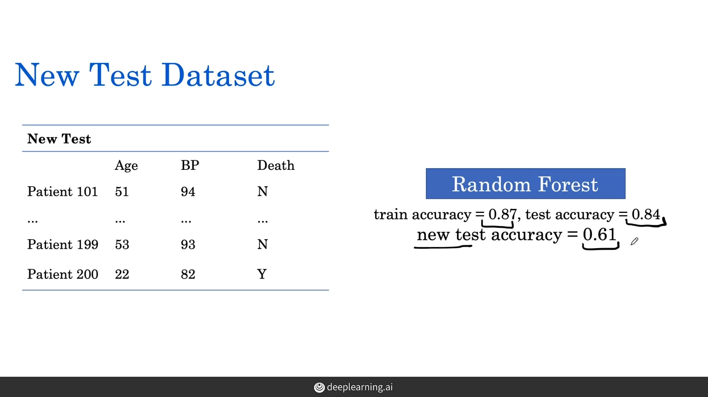

+++
title = 'Notes on AI for Medical Prognosis - AI for Medicine Specialization Series II'
date = 2024-06-06T16:37:31-07:00
draft = false
+++

>This note is generated for my learning of **AI for Medical Prognosis** by deeplearning.ai. Any errors or misrepresentations are almost my own.

## Risk of Getting Disease "Medical Prognosis"
- Prognosis: predicting risk of a future event.
    - event: death, heart attack, stroke
    - risk: can be for a patient with a specific medical condition or for a general population
- Prognosis useful in many ways:
    - to inform Patients (1) risk of certain illness, (2) survival with illness
        - e.g. cancer staging (survival time with certain cancer)
    - Guide treatment:
        - e.g. 10-year risk of heart attack can lead to whether should get drugs
        - e.g. 6-month mortality risk for terminal disease can lead to whether should receive end-of-life care
    
## Prognostic Models in Medical Practice
### Examples of Prognostic Tasks
- **A Prognostic Model structure**
    - **Input**: **profile info**, such as clinical history, physical examinations, labs and imaging results
    - **Output**: risk score, can be arbitrary numbers or a probability (percentage)
    
    - e.g. 2 profile features ((1) smoker & (2) age>=75) to predict risk value for heart disease
        - can use score coefficient for each feature, and add up to have the final score
        - each feature can have different weights (i.e. coefficient)
        
- **Atrial Fibrillation (AF) 心房纤维性颤动（房颤） Example**
    - Atrial Fibrillation is a common abnormal heart rhythm that puts patient at risk of stroke, which is when blood flow to an area of brain is cut off.
    - Model will look at 1-year risk of stroke for AF patients
    - CHA $_2$ DS $_2$ - VASc score: abbreviation of features used in model profile:
        
        - we will have feature item "hypertension", "diabetes mellitus", and "age 65-74" to have value 1 and all others 0 for this patient
        - get risk score of 3 for this patient
- **Liver Disease Mortality Example**
    
    - 3-month mortality for patients, used to determine how quickly a patient can get a liver transplant on the waiting list
    - risk score: **Model for End-State Liver Disease (MELD)** score
        
        - need to take Ln for creatinine 肌酸酐, bilirubin 胆红素, and INR 血浆凝血酶原时间测定 values.
            - why? when we believe the feature is linear in the natural log of the features.
        - intercept score: value always 1, i.e. even if you don't have any thing (all other value = 0) you still subject to risk score of 0.643
        - finally we multiply the raw score by 10 to have the MELD score
    - the risk score per se does not mean probability, but relevancy in high or low can give a upper or lower position in the waiting list
- **10 year Risk of Heart Disease**
    - used for patients 20 or older who **don't already yet** have heart disease, and to see their current healthy but in 10 years risk of heart disease
    - Risk Score: ASCVD (Atherosclerotic Cardiovascular Disease 心血管动脉粥样硬化) Risk Estimator Plus 
    
        - notice we have an "**interaction term**" $Ln$ Age $\times$ $Ln$ HDL-C
        - also we have some negative coefficient which means the features are negatively associated with the risk of disease
        - finally we use the sum into a risk function (sum now serves as a exponent) to get the probability
        
### Risk Score Computation
- will look at risk equations and interaction terms
#### risk equations: 
e.g. in the form: $Score = Age \times coefficient_{Age} + ... + BP \times coefficient_{BP} $
    - can be linear in natural log $Ln$ or log 10 $lg$
    - can also have interaction terms
    
#### Interaction terms:

where we observe increase in risk given one variable fixed, that is, both variables give same kind of influence in risk.
But, in reality, when you have super high BP or high age, the weight of another variable becomes less important, and your risk may not be linear, therefore we consider the interaction terms. The risk level have changed their impact if we fixed certain variable:

For example, when in super high age, no matter level of BP, patients will expose to high risk of heart disease.
## Evaluate Prognostic Models
### Basic Terms: Concordant, Discordant, Risk Tie, & Permissible pair
- to see how well it performs on pairs of patients
- for example, risk score model: died within 10 years? 
    - Patient with worse health should have a higher risk score
        - for each pair, we observe "**concordant**" 
        - otherwise: **not concordant** or **discordant** (better health with higher risk or worse health with lower risk)
    - what if the risk score ties? 
        - Risk Ties
        - we actually do not consider these pairs when evaluate model
        - i.e. we only consider *pairs where the outcomes are different*, or **permissible pair**
    - with **permissible pairs** we can evaluate prognostic models
        
        - we further have **C-Index** 
### C-Index (Concordance-Index)
#### What is C-Index?
- C-Index means the possibility of the model prediction of the probability that the risk score for worse patient is larger than the risk score of the healthier patient.
    - $P(\text{score}(A) > \text{score}(B) | Y_A > Y_B) $
    - score($A$) and score($B$) is the predicted risk score for the patient pair
    - $Y_A$ and $Y_B$ are the ground truth of the health condition of the pair
- Interpretation:
    - for a random model, C-Index should be $0.5$, because random guess will be $50\%$ correct at the time
    - for a perfect model score, C-Index should be $1$, correct every time
    
#### How to calculate C-Index?
- Formula:
$$ \text{C-Index} = \frac{\text{concordant pairs} + 0.5 \times \text{risk ties}}{\text{total permissible pairs}} $$

- Calculation Example:
    - first get the **permissible pairs** from **all possible pairs**
    - from the permissible pairs, look at the risk score and get the **concordant** and **risk tie pairs**
    
## Tree-Based Models
### Decision Trees for Prognosis
- Why tree models are useful in Medical applications?
    - the ability to handle both continuous and categorical data
    - interpretability
    - speed to train
- Use trees to model nonlinear relationships
    - our task: predicting short-term mortality for hospital patients
#### Decision Tree and Random Forest
- Goal: to predict 10-year risk of death
    - 
    - Systolic Blood Pressure: BP in your blood vessels when your heart beats
    - plot: Ground Truth = {red: died, blue: alive}
    - 
        - The linear model output, a lot of misclassifications
    - Alternatives: Decision Tree model output:
    
        - can partition the input feature space into regions
        - A tree with "if-then" structure
        - the class boundaries of decision trees are always vertical or horizontal
        
- How to Build a Decision Tree?
    1. Pick a variable (e.g. age or BP)
    2. find a value of that variable that partitions the data (e.g. age >= 60, or BP > 160)
        - 1 & 2 here are picked such that one partition will contain mostly red and other contains blue (classification)
    3. Have prognosis risk prediction: fraction of patients dead
    
    4. binarize output into low risk v. high risk group:
    
#### Challenge: Overfitting

- How to overcome overfitting?
    - Max Depth
        
    - Random Forest
        - Random Forest construct multiple decision trees and average their risk predictions
        
            - for a patient, we have each tree come up with the prediction of risk e.g. 20%, 50%, 10%, 
            - then we average these to have a risk prediction of 15%
        - Training Random Forest
            - each tree is constructed using a random sample of the patients
            - e.g. for tree 1, can construct with patient-1, patient-2, patient-1... one example can be used multiple times because **random forest samples with replacement**!
            - then the random forest algorithm **modifies the splitting procedure** in the construction of decision trees, s.t. it uses a **subset of features** when creating decision boundaries 
            - then build multiple decision trees given the data (patients (sample with replacement) and their features (subset thereof)). 
        - Benefits of Random Forest:
            - generally boost the performance over single trees
            
            - also called **"ensemble learning method"** because it uses multiple decision trees to obtain better predictive performance than could be obtained from any of the decision trees alone.
            - Other ensembling decision tree algorithm examples:
                

### Survival Data and Identify Missing Data
One key task is to make survival predictions using survival data. In order to model survival, we need to put data ina form that we can process. The primary challenge is "**Sensor data**", particular form of **missing data**.

- Dealing with Missing Data
    - DROP missing data row when creating train/test split
        
        - we then train the dropped clean data with random forest and get the following result:
               
        - Problem with Dropping method:
            - when we have a new test dataset with no dropped rows (no missing data) we surprisingly have very low test accuracy:
                
            - just recap what did we do:
                
            - Why low accuracy?
        - **Different Distribution of datasets!** 
            -*? but it has nothing to do with dropping method right? inherently it is due to distribution, or skewed data problem, not dropping* - will have explanation later!! good critical thinking here!
            - the old test data have very small portion of data with age < 40, but new test set has a lots of data with age < 40. When we look at the age split accuracy, we found the model has low accuracy for age < 40 (55%) but decent for age > 40 (85%), and therefore, for old test set, the influence of the low accuracy group has low impact on the overall accuracy, whereas in the new test set, it has more impact and thus dragging the whole accuracy down:
             
            - now why we have less young cases in the first place? 
                - **Are we actually dropped a lot of young cases??**
                - Yes we did! 
                
                - so it is real life systematic reasons: BP maybe routine part of care for older patients so almost all older patients have BP record, but not so much (physicians can care less) for younger patients therefore most missing data come from younger patients.
                - **"systematic missingness" to the data**
            
                - most inappropriate for the data group that are dropped (i.e. non-smoking and not BP tx)
- Why is data missing? 3 Categories:
    - 1. Missingness Completely at random
        - coin flipping: 
        - since it is purely random regardless of patient features, therefore we would expect distribution for with missing data (not dropped yet) and without missing data (clean data) to be very similar
            - therefore, it is **not** a biased model
             probability of missing data is constant       
    - 2. Missingness at Random
        - feature dependent and somewhat coin flipping: 
        - distribution?
            - for age>40 very similar, but for age<40, will be halved
            
        - missingness dependent only on available information (some features)
    - 3. Missingness NOT at random
        
        - dependent on "patients waiting" but it is not observable (**unobservable**), that "feature" is never recorded in the data to be processed
        
        - missingness dependent on unavailable information (unrecorded features)
        
### Imputation to Handle Missing Data
Impute = "fill in missing value"
impute replace a missing data with an estimated value based on other available information. Two important imputation methods: (1) Mean imputation; (2) REgression imputation
#### Case study: CVD (Cardio Vascular Disease) Prediction
some SVD: heart attack, strokes, etc.

- Mean Imputation
    
    - then fill in the mean = 140 to the missing data
    
        - also remember, we will use the mean in training set to fill in missing part in test set as well!!
            - do not compute test mean and fill in another value.
            
            
- Regression Imputation
    - we can see that mean imputation maynot capture the data trend in general, therefore we can try regression
    - after splitting, we then need to figure out a regression model:
        - **$BP = coefficient_{age} \times age + offset$**
        
        - $y = mx + c$
        - after fitting data, we get: BP = 0.6 $\times$ age + 115
    - Then fill in the data for all missing BPs
- Recap for imputation method
    -     
## Survival Model
### Survival Model Question
Previously prognosis risk model question: "What is the probability of dying in 10 years?" Now we extend the question to ask "what is the probability of survival past anytime (t)?"

    
    
### Survival Function and Properties
- Survival Function (Key tool in analysis survival model)
    - $ S(t) = Pr(T > t)$
        - $S(t)$ is the "survival probability"
        - $T$ is the Time to an Event
        - $t$ is the time of interest
- **Properties**:
    - non-increasing function (Survival Function can never go up)
        
    - start off at 1, and end approaching 0
        
    - Quiz: 
### Time to Event Data
Primary challenge for building survival model is [**censored observations**](https://en.wikipedia.org/wiki/Censoring_(statistics)), also a particular form of missing data.
- previous prognostic models:
    
    - but now, we need "when" i.e. survival past anytime t
- Survival Data
    
    - censoring data: we have not yet found the event happening in the time frame available
        - i.e. some patients just withdraw from the study, or study ends before the patient has an event, etc.
        
- Right Censoring
    - the time to event is only known to exceed a certain value (last contact)
        
    - several types of right censoring:
        - end-of-study censoring
        - loss-to-follow-up censoring
        
### Estimate Survival with Censored Data
#### Estimate survival model
- Example: What is the probability of survival to $t$ month?
    
    - $S(t) = Pr(T>t)$ use t = 25 months 
        - **$S(25) = Pr(T>25) = \frac{\text{num survived to 25 months}}{\text{total num patients}} $**
        - two assumptions:
            - First assumption: **die immediately** for censored data
            - second assumption: **never die** for censored data
            
        - in reality, *we must have some value in between those two assumptions*.
            - Assume that we call and followup with the censored patient and get the ground truth (real time for the event)
            
- Problem: **How to estimate probability of survival past 25 months with censored observations?** without the call (ground truth)
#### Chain Rule of Conditional Probability
- discrete model chain rule
    
- derive to another form：
    
    - benefits: occurrence for $Pr(T=25|T\geq 25)$ is just the occurrence of 25 of $T_i$ over $T\geq 25$ and thus if no such occurrence in data, the whole term is just 1 (can be ignored!!)
    
        - for this calculation, we have a new estimate! 5/9!! is very close to 4/7 real outcome!
    - rewrite in a more concise form:
        
#### Kaplan Meier Estimate
- key thing: the survival function is applied to all the patients in the population, it is not specific to a particular patient
    
    
## Build a Risk Model Using Linear and Tree-based Models
Learning objective: 
- Strategies to **(1) build and (2) evaluate** **survival prediction models** to compare the risks of individual patients. 
- **2 Prediction models**:
    1. Cox proportional hazards
    2. Survival Trees
- **Metrics to Evaluate Models**:
    - **Harrell's C-index**: to **evaluate** the prediction performance of the survival models
- **Important Tools**
    - Survival Function
    - Hazard Function
    - Cumulative Hazard Function
### Survival and Hazard Functions 

